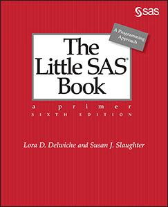

# The Little SASⓇ Book: A Primer, Sixth Edition

by Lora Delwiche and Susan Slaughter

This repository contains the example data for the book *The Little SASⓇ Book, Sixth Edition*. All data sets are in the form of .csv, .dat., txt., and .xlsx files.

## Description
A classic that just keeps getting better, <i>The Little SAS Book</i> is essential for anyone learning SAS programming. Lora Delwiche and Susan Slaughter offer a user-friendly approach so that readers can quickly and easily learn the most commonly used features of the SAS language. Each topic is presented in a self-contained, two-page layout complete with examples and graphics.

Nearly every section has been revised to ensure that the sixth edition is fully up-to-date. This edition is also interface-independent, written for all SAS programmers whether they use SAS Studio, SAS Enterprise Guide, or the SAS windowing environment. New sections have been added covering PROC SQL, iterative DO loops, DO WHILE and DO UNTIL statements, %DO statements, using variable names with special characters, the ODS EXCEL destination, and the XLSX LIBNAME engine.

This title belongs on every SAS programmer's bookshelf. It's a resource not just to get you started, but one you will return to as you continue to improve your programming skills.

## Details

*Epub* ISBN: 978-1-64295-343-5 
*Kindle* ISBN: 978-1-64295-344-2 
*PDF* ISBN: 978-1-64295-342-8 
*Paperback* ISBN: 978-1-64295-283-4 
*Hardback* ISBN: 978-1-64295-616-0

<a href="https://www.sas.com/storefront/aux/en/splsb/73044_excerpt.pdf"><i>Book Excerpt and Table of Contents</i></a>

*About the Authors*:  
<a href="https://support.sas.com/en/books/authors/lora-delwiche.html">Lora Delwiche</a> and <a href="https://support.sas.com/en/books/authors/susan-slaughter.html">Susan Slaughter</a>

## License

This project is licensed under the [Apache 2.0 License](./LICENSE).
